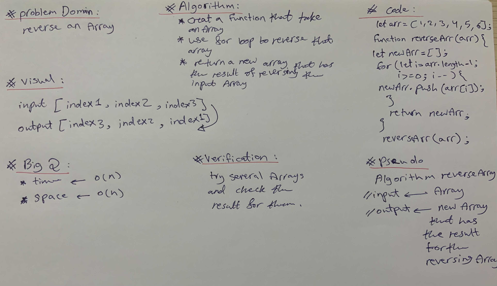

# Reverse an Array
Write a function called reverseArray which takes an array as an argument. Without utilizing any of the built-in methods available to your language, return an array with elements in reversed order.
## Whiteboard Process

## Approach & Efficiency
read the code challange 2 times then write the steps and ask what is the input and what should be the output then when I had a clear vision of the code I start writting it 
