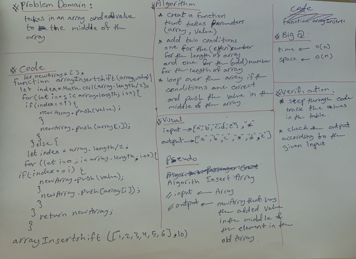

# Insert and shift an array in middle at index

Write a function called insertShiftArray which takes in an array and a value to be added. Without utilizing any of the built-in methods available to your language, return an array with the new value added at the middle index.

## Whiteboard Process

## Approach & Efficiency
read the code challange many times then write the steps on papare, break the problem into sub-problems.and ask what is the input and what should be the output then when I had a clear vision of the code I start writting it.