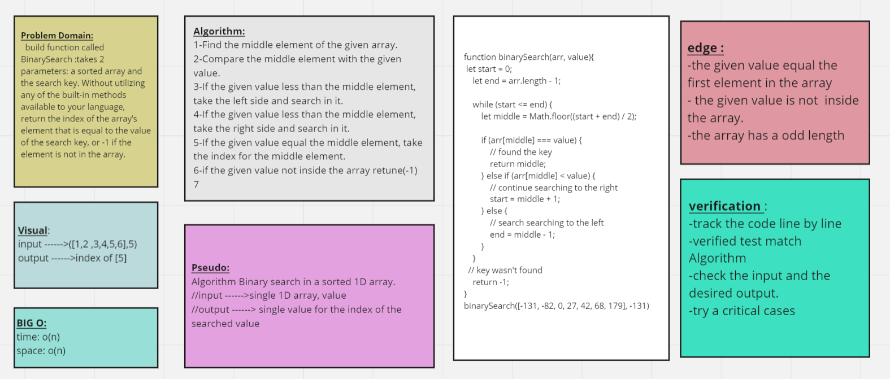

# Binary Search of Sorted Array

 build function called BinarySearch :takes 2 parameters: a sorted array and the search key. Without utilizing any of the built-in methods available to your language, return the index of the array’s element that is equal to the value of the search key, or -1 if the element is not in the array.

## Whiteboard Process

## Approach & Efficiency

read the code challange many times then write the steps on papare, break the problem into sub-problems.and ask what is the input and what should be the output then when I had a clear vision of the code I start writting it.