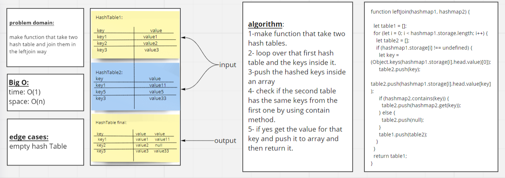

## Hashtables
[Intro to Hash Tables](https://codefellows.github.io/common_curriculum/data_structures_and_algorithms/Code_401/class-30/resources/Hashtables.html)
### Terminology:

#### Hash - is the result of some algorithm taking an incoming string and converting it into a value that could be used for either security or some other purpose. In the case of a hashtable, it is used to determine the index of the array.

#### Buckets - A bucket is what is contained in each index of the array of the hashtable. Each index is a bucket. An index could potentially contain multiple key/value pairs if a collision occurs.

#### Collisions - A collision is what happens when more than one key gets hashed to the same location of the hashtable.

### Internal Methods
#### Add()
When adding a new key/value pair to a hashtable

- send the key to the GetHash method.
- Once you determine the index of where it should be placed, go to that index
- Check if something exists at that index already, if it doesn’t, add it with the key/value pair.
- If something does exist, add the new key/value pair to the data structure within that bucket.

## Structure
### Hashing
Basically, a hash code turns a key into an integer. It’s very important that hash codes are deterministic: their output is determined only by their input. Hash codes should never have randomness to them. The same key should always produce the same hash code.

### Creating a Hash
A hashtable traditionally is created from an array. I always like the size 1024. this is important for index placement. After you have created your array of the appropriate size, do some sort of logic to turn that “key” into a numeric number value. Here is a possible suggestion:

1- Add or multiply all the ASCII values together.
2- Multiply it by a prime number such as 599.
3- Use modulo to get the remainder of the result, when divided by the total size of the array.
4- Insert into the array at that index.

#### Find()
The Find takes in a key, gets the Hash, and goes to the index location specified. Once at the index location is found in the array, it is then the responsibility of the algorithm the iterate through the bucket and see if the key exists and return the value.

#### Contains()
The Contains method will accept a key, and return a bool on if that key exists inside the hashtable. The best way to do this is to have the contains call the GetHash and check the hashtable if the key exists in the table given the index returned.

#### GetHash()
The GetHash will accept a key as a string, conduct the hash, and then return the index of the array where the key/value should be placed.

## Hash table
[basics of hash tables](https://www.hackerearth.com/practice/data-structures/hash-tables/basics-of-hash-tables/tutorial/)
A hash table is a data structure that is used to store keys/value pairs. It uses a hash function to compute an index into an array in which an element will be inserted or searched. By using a good hash function, hashing can work well. Under reasonable assumptions, the average time required to search for an element in a hash table is O(1).

#### Collision resolution
[hash table wiki](https://en.wikipedia.org/wiki/Hash_table)
Hash collisions are practically unavoidable when hashing a random subset of a large set of possible keys. For example, if 2,450 keys are hashed into a million buckets, even with a perfectly uniform random distribution, according to the birthday problem there is approximately a 95% chance of at least two of the keys being hashed to the same slot.

Therefore, almost all hash table implementations have some collision resolution strategy to handle such events. Some common strategies are described below. All these methods require that the keys (or pointers to them) be stored in the table, together with the associated values.

## Challenge (30): Hash Tables Implementation 

### Features
#### Implement a Hashtable Class with the following methods:

#### add
- Arguments: key, value
- Returns: nothing
- This method should hash the key, and add the key and value pair to the table, handling collisions as needed.

#### get
- Arguments: key
- Returns: Value associated with that key in the table

#### contains
- Arguments: key
- Returns: Boolean, indicating if the key exists in the table already.

#### hash
- Arguments: key
- Returns: Index in the collection for that key

# Challenge (31)
Problem Find the first repeated word in a book.

## Feature Tasks
#### Write a function called repeated word that finds the first word to occur more than once in a string
#### Arguments: string
#### Return: string

## Make tests
#### empty string
#### no reapte words
#### return the first reapeted words

## white board

## Code Challenge 33
#### Implement a simplified LEFT JOIN for 2 Hashmaps.

### Feature Tasks

### Write a function called left join
#### Arguments: two hash maps
- The first parameter is a hashmap that has word strings as keys, and a synonym of the key as values.
- The second parameter is a hashmap that has word strings as keys, and antonyms of the key as values.
### Return: The returned data structure that holds the results is up to you. It doesn’t need to exactly match the output below, so long as it achieves the LEFT JOIN logic

## white board

