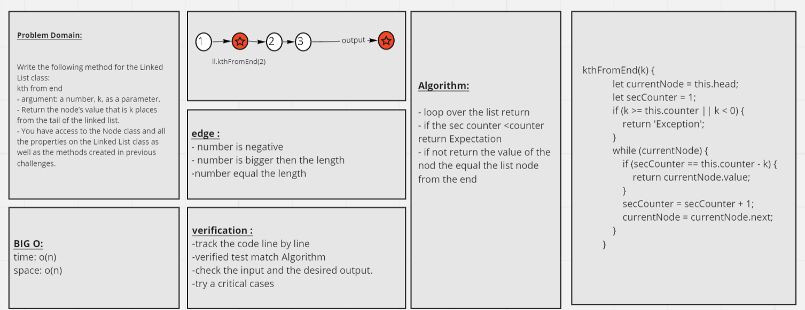

# Singly Linked List

A data structure that contains nodes each node(the individual links inside a linked list and it contains the data for the link) references the next Node in the list (by the proparity next). there are 2 typs: Singly and Doubly,

## Challenge

### part(1):
Linked List Implementation:
creat **Singly Linked List** that:
1- insert: Adds a new node with that value to the head of the list with an O(1) Time performance.
2- includes: Indicates whether that value exists as a Node’s value somewhere within the list.
3- to string: Returns a string representing all the values in the Linked List, formatted as:
"{ a } -> { b } -> { c } -> NULL"

### part (2):
Write the following method for the Linked List class:

kth from end

- argument: a number, k, as a parameter.
- Return the node’s value that is k places from the tail of the linked list.
- You have access to the Node class and all the properties on the Linked List class as well as the methods created in previous challenges.

## Approach & Efficiency

#### Approach

1- read the instruction carefully.

2- trying have clear understanding for the concept before starting.

3- start writing the code after having clear vision of what I should do.

4- go throw each test and try different cases to make sure it will pass.  

#### Efficiency

Big O:
- time:  o(n)
- space: o(n)

## API

1- insert: Adds a new node with a value to the head of the list with an O(1) Time performance.

2- includes: Indicates whether a value exists as a Node’s value somewhere within the list.

3- to string: Returns a string representing all the values in the Linked List, formatted as:
"{ a } -> { b } -> { c } -> NULL"

4- append: adds a new node with the given value to the end of the list.

5- insert before: adds a new node with the given new value immediately before the first node that has the value 
specified.

6- insert after: adds a new node with the given new value immediately after the first node that has the value specified.

7- create a function that take a k-th value and return the node value for the k-th from the end of a linked list.

## whiteboard:

### code challenge(6):

### code challenge(7):

