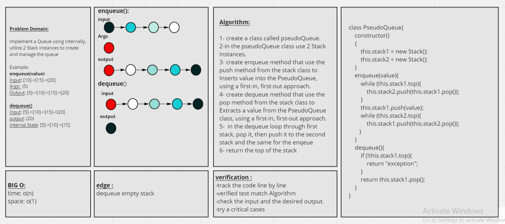
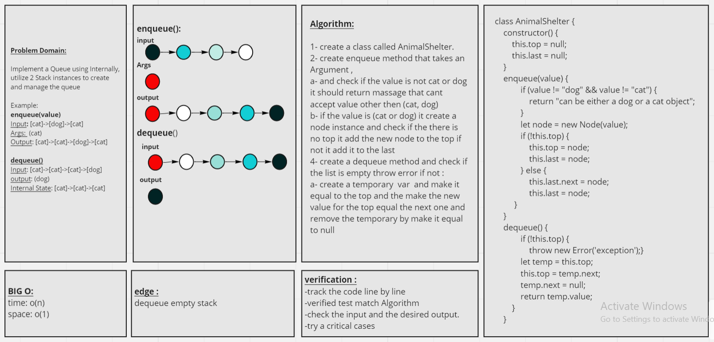

# Stacks and Queues
stack is a data structure that consists of Nodes. Each Node references the next Node in the stack, but does not reference its previous.

### Stack terminology:
- Push: push Nodes into the stack
- Pop: removed Node from the stack are popped.
- Top: This is the top of the stack.
- Peek: view the value of the top Node in the stack. 
- IsEmpty: returns true when stack is empty otherwise returns false.

#### Stacks follow concepts:
- FILO: (First In Last Out) the first added node popped the last node out of stack
- LIFO: (last in first out) the last added nod popped the first thing out of the stack

### Stack terminology:
- Enqueue: Nodes or items that are added to the queue.
- Dequeue: Nodes or items that are removed from the queue.
- Peek: When you peek you will view the value of the front Node in the queue. If called when the queue is empty an exception will be raised. 
- IsEmpty: returns true when queue is empty otherwise returns false.

#### Queue concepts:
- FIFO (First In First Out) This means that the first item in the queue will be the first item out of the queue.
- LILO (Last In Last Out) This means that the last item in the queue will be the last item out of the queue.

# Challenge(10):
Using a **Linked List** as the underlying data storage mechanism, implement both a **Stack** and a **Queue**.

# Approach & Efficiency
- Efficiency :**bigO(1)**
- Approach: follow all the instructions, and after finish the code do the required tests.

# API
* **push()**:adds a new node with that value to the top of the stack with an O(1) Time performance.
* **pop()**: 1- Returns the value from node from the top of the stack, Removes the node from the top of the stack
and raise exception when called on empty stack
* **isEmpty()**: Returns Value of the node located at the top of the stack and raise exception when called on empty stack
* **peek()**: Returns Boolean indicating whether or not the stack is empty.

# Challenge(11):

#### Implement a Queue using two Stacks.

### Feature Tasks

#### Create a new class called pseudo queue. this PseudoQueue class will implement our standard queue interface (the two methods listed below), Internally, utilize 2 Stack instances to create and manage the queue
##### Methods:
###### enqueue**
- Arguments: value
- Inserts value into the PseudoQueue, using a first-in, first-out approach.
###### dequeue
- Arguments: none
- Extracts a value from the PseudoQueue, using a first-in, first-out approach

# Approach & Efficiency
- Efficiency :**bigO(1)**
- Approach: follow all the instructions, and after finish the code do the required tests.

# API
* **push()**:adds a new node with that value to the top of the stack with an O(1) Time performance.
* **pop()**: 1- Returns the value from node from the top of the stack, Removes the node from the top of the stack
and raise exception when called on empty stack
* **isEmpty()**: Returns Value of the node located at the top of the stack and raise exception when called on empty stack
* **peek()**: Returns Boolean indicating whether or not the stack is empty.

### whiteboard:

# Challenge(12):

#### First-in, First out Animal Shelter.

### Feature Tasks

##### Create a class called AnimalShelter which holds only dogs and cats.
##### The shelter operates using a first-in, first-out approach.
##### Implement the following methods:
- enqueue:
Arguments: animal
animal can be either a dog or a cat object.
- dequeue
Arguments: pref
pref can be either "dog" or "cat"
##### Return: either a dog or a cat, based on preference.
- If pref is not "dog" or "cat" then return null.

# Approach & Efficiency
- Efficiency :**bigO(1)**
- Approach: follow all the instructions, and after finish the code do the required tests.

### whiteboard:

