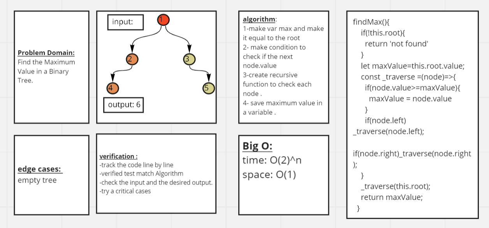
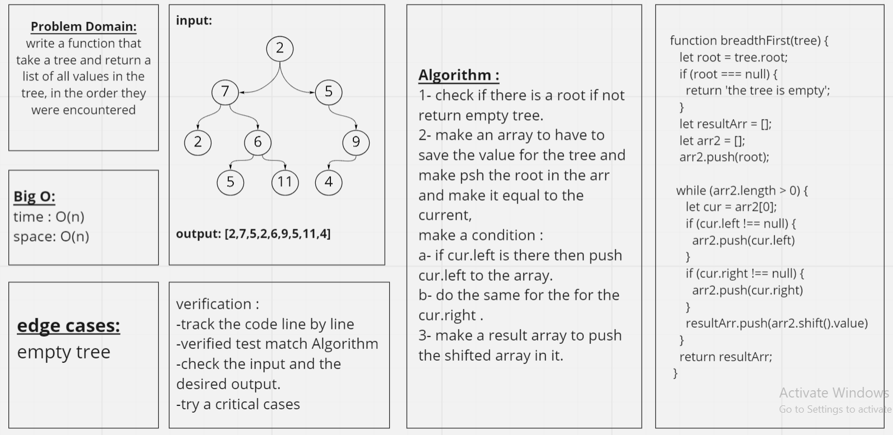
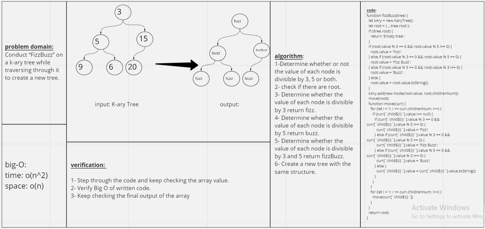

# Trees

## Code challenge(15): 
### Implementation Trees

#### Create a Binary Tree class
##### Define a method for each of the depth first traversals:
- pre order, in order, post order which returns an array of the values, ordered appropriately.
- the code should raise/throw a custom, semantic error that describes what went wrong in calling the methods you wrote for this lab.

### Binary Search Tree
#### Create a Binary Search Tree class
##### This class should be a sub-class of the Binary Tree Class, with the following additional methods:
- **Add** 
- **Arguments: value**
- **Return: nothing**

#### The Add method should add a new node with that value in the correct location in the binary search tree.

#### Adding  a search method that indicating whether or not the value is in the tree at least once.
- Argument: value
- Returns: boolean 

 
 
 
- there was a cooperation with me and my friends 

## Code challenge(16): 
### Find the Maximum Value in a Binary Tree

### Feature Tasks
#### Write the following method for the Binary Tree class

##### find maximum value
- Arguments: none
- Returns: number
##### Find the maximum value stored in the tree. You can assume that the values stored in the Binary Tree will be numeric.

### URL

## Code challenge(17): 

#### Feature Tasks
- Write a function called breadth first
- Arguments: tree
- Return: list of all values in the tree, in the order they were encountered

### URL

## Code Challenge (18):

#### Conduct “FizzBuzz” on a k-ary tree while traversing through it to create a new tree.

#### Set the values of each of the new nodes depending on the corresponding node value in the source tree.

#### Feature Tasks
- Write a function called fizz buzz tree
- Arguments: k-ary tree
- Return: new k-ary tree

##### Determine whether or not the value of each node is divisible by 3, 5 or both. Create a new tree with the same structure as the original, but the values modified as follows:

- If the value is divisible by 3, replace the value with “Fizz”
- If the value is divisible by 5, replace the value with “Buzz”
- If the value is divisible by 3 and 5, replace the value with “FizzBuzz”
- If the value is not divisible by 3 or 5, simply turn the number into a String.

### White Board

##### I work as a group on this code challenge and it was seaad idea 

